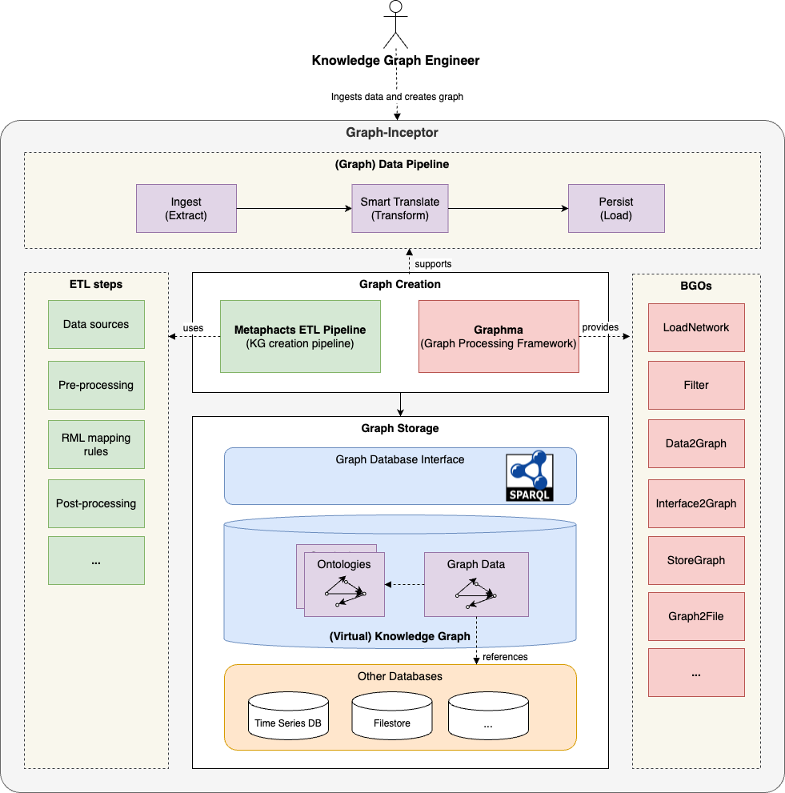

# Graph-Inceptor

This is the main repository for the Graph-Inceptor tool developed in the Graph-Massivizer project.

## Description

### Purpose

Creation of knowledge graphs (KGs), processing and storage of graph data. 

### Key features

Graph-Inceptor offers two main services:

* A **KG creation pipeline** that 
    * supports various source data file formats;
    * uses declarative mappings (i.e., no programming required) to transform source data to graph data; and
    * stores the resulting graph data in a graph database.

* A **graph processing framework** that
    * reads source or graph data in various formats;
    * offers in-memory access and processing of graph data in various representations; and
    * saves the resulting graph data in various graph file formats.

### Architecture

The figure above shows the architecture of the Graph-Inceptor tool. The tool consists of two subsystems, namely the **Graph Creation** and the **Graph Storage**. The **Graph Creation** subsystem supports the creation of different types of **(Graph) Data Pipelines** by a **Knowledge Graph Engineer**. As described above, Graph-Inceptor offers two main services. These services are implemented by two separate components:

1. The [Metaphacts ETL Pipeline](https://github.com/graph-massivizer/graph-inceptor-etl-pipeline) provides a blueprint implementation for a *KG creation pipeline*. The pipeline can read various data sources and map them to RDF, as well as do pre- and post-processing of the data. The result is a **(Virtual) Knowledge Graph** which is stored in a **Graph Storage**. It is not necessary that all source data is converted to RDF. A virtualization approach allows referencing original data in other databases, e.g., time series data or binary files. Access and querying of the KG is supported by well-defined and standardised interfaces through SPARQL endpoints.

2. [Graphma](https://github.com/graph-massivizer/graph-inceptor-graphma) is a *graph processing framework* developed by SINTEF. It reads, assembles, and processes raw or graph data from different formats, offering in-memory access and integration across various processes, and  saving the resulting graph data in various graph file formats. Graphma will support a set of basic graph operations (BGOs) such as LoadNetwork, Filter, Data2Graph, Interface2Graph, StoreGraph, Graph2File, etc.

### Source code repositories

The two components are maintained in two separate repositories on GitHub:

* https://github.com/graph-massivizer/graph-inceptor-etl-pipeline
* https://github.com/graph-massivizer/graph-inceptor-graphma

### License

Graph-Inceptor is released as open source software under the [Apache License, Version 2.0](https://opensource.org/license/apache-2-0/)

### Programming Languages

The [Metaphacts ETL Pipeline](https://github.com/graph-massivizer/graph-inceptor-etl-pipeline) is released as a blueprint implementation on AWS cloud. It uses declarative mappings, which means that no programming is required. However, you will need to define mapping in the [RML language](https://rml.io/specs/rml/).

The [Graphma](https://github.com/graph-massivizer/graph-inceptor-graphma) framework is released as a Java library. In addition to Java, it currently also supports the [Kotlin](https://kotlinlang.org/) programming language. We are also considering using [Apache Arrow](https://arrow.apache.org/) to support other programming languages.

### External Libraries

TBD

### Examples

Use Case 0 example. TBD

## Integration

Graph-Inceptor provides the functionality required to create a (Virtual) Knowledge Graph for the data sources provided by the use cases in the Graph-Massivizer project. The KG is the starting point for further operations and processing of graph data through basic graph operations (BGOs) supported by Graph-Inceptor and Graph-Scrutinizer.

## Tests

Both components of Graph-Inceptor intend to use unit testing to main individual functions (e.g., the implementation of a set of BGOs). However, this is not sufficient to main that a **Graph Data Pipeline** actually works. For this we also need integration testing. A first step in defining such integration tests is to have a fully working data pipeline, e.g., the Use Case 0 (UC-0) example described above.
